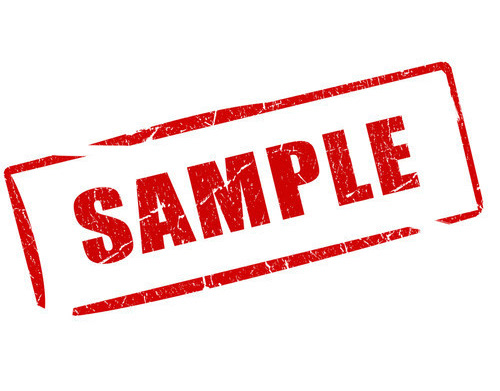

There are some useful features for Markdown here:
* [Links](#Links)
* [Toggle block](#Toggle-block)
* [Images](#Images)

# Links
Typical construction is:
```
  [some text](link)
```

Let's see some types of links:
* [Web Links](#Web-links)
* [Internal Document Links](#Internal Document Links)


#### Web links:
```
[web link](https://ya.ru/)
```
[web link](https://ya.ru/)

#### Internal Document Links
```
[To Links Chapter](#Links)
```
[To Links Chapter](#Links)

Also you can use an empty text block to create an anchor, like:  
`[](#anchors-in-markdown)`


# Toggle block
```
<details>
  <summary>Summary text.</summary>
  <code style="white-space:nowrap;">Hello World, how is it going?</code>
</details>
```
<details>
<summary>Summary text.</summary>
<code style="white-space:nowrap;">Hello World, how is it going?</code>
</details>

# Images

Add image in .md-file using command:
```

```


Change image sizes using html-tags:
```

```

